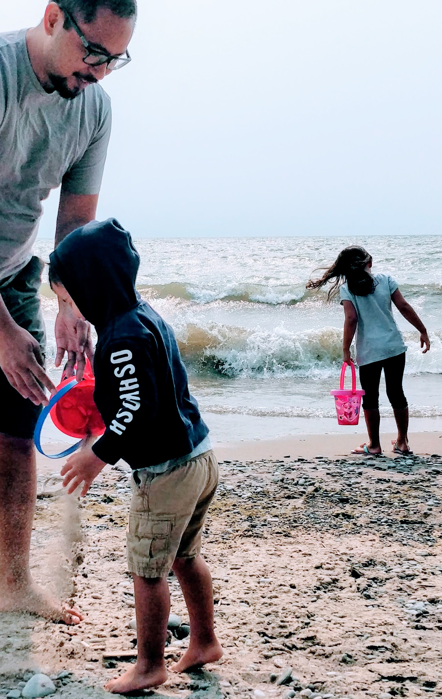

## Hi there

My name is Michael.  I have a wonderful family of 4, and my life goal is their happiness.

I understand that in order to make strides in my career, I must constantly learning, because there will always be a new technology, skill or technique.  If you aren't learning, you may be left behind.

Thus, in addition to having a portfolio that you are currently reading, I made this version specifically to learn the basics of Gatsby.

I also made a Wordpress version (to learn the basics of wordpress) here:
**https://michaelelim.wordpress.com**

My main skills are the following: 
- Process Management
- Web Development
- Digital Marketing
- Project Management

As of this date (2020-10-07) my tech stack is as follows:
- HTML
- CSS
- SASS
- Javascript
- React.js
- Node.js
- Express
- Websockets
- Socket.io
- DOM and Web APIs
- MySQL
- Git

And thanks to Panr (who created this Starter), I am learning Gatsby!

So, there you have it... thanks for reading!
