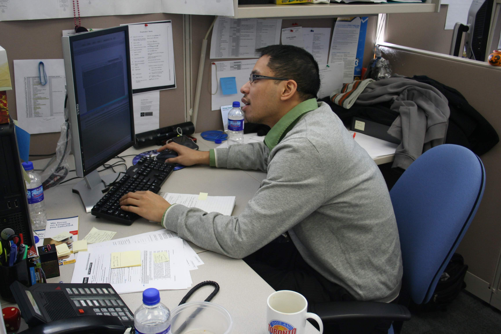

It can very difficult to take the plunge and leave your current career path and explore other career choices. 

Before taking the leap, you have to ensure that your life is in order.  

In particular, you should have the following in your life:
- 6+ months of savings (Ensures you have a financial cushion should you be unable to find a job quickly)
- The proper education/credentials/network to pursue the new career (It is always more difficult to find a job in a new field)
- Grounded headspace (Positivity leads to better job choices/interviews/outcomes)
- Household buy-in (You want your immediate family in your corner to help motivate you and push you forward)
- No big ticket purchases on the horizon (Being strapped for cash will dash your dreams in a heartbeat)

**It is important to ensure that all this is in order, or you may lose everything in pursuit of your new career.**

As in every decision you make, do not make a career change with fully weighing the pros and cons!  There are risks with finding a new career, and unless you already have the job lined up, you may not be able to slide right into the new field.  

Talk to people that you trust whether it's family, a friend, or a mentor.
Otherwise, get professional advice prior to proceeding.

As per everything you do, you need to think positively.  Once you stop believing in yourself, there is no way that you should make a life-altering move like a career change until you can get back in a positive headspace. 

Good luck, and be safe!